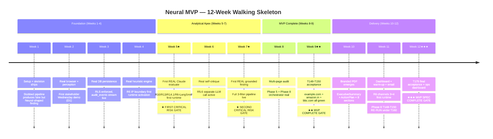

# Neural MVP — Visual Roadmap Tracker

> **Companion to** [implementation-roadmap.md](implementation-roadmap.md) **v0.3.** At-a-glance views for engineering tracking + stakeholder communication. Open this file when you want to see the big picture; open the main roadmap when you need per-week task IDs.

---

## 1. Capability progression matrix

12 layers × 12 weeks. Read across each row to see when a capability becomes real. Read down each column to see system state at that week.

```
LEGEND:  ⬜ stub / not yet present     🔧 transitioning this week (real impl lands)     ✅ real (de-stubbed)
GATES:   ★ risk gate     ★★ MVP COMPLETE     ★★★ MVP SPEC COMPLETE
```

```
                              W1   W2   W3   W4   W5★  W6   W7★  W8   W9★★ W10  W11  W12★★★
                              ──   ──   ──   ──   ──   ──   ──   ──   ──   ──   ──   ──
 1. CLI Skeleton              ✅   ✅   ✅   ✅   ✅   ✅   ✅   🔧   ✅   ✅   ✅   ✅
 2. Browser + Perception      🔧   ✅   ✅   ✅   ✅   ✅   ✅   ✅   ✅   ✅   ✅   ✅
 3. DB Persistence            ⬜   ⬜   🔧   ✅   ✅   ✅   ✅   ✅   🔧   ✅   🔧   ✅
 4. Heuristic Engine          ⬜   ⬜   ⬜   🔧   ✅   ✅   ✅   ✅   ✅   ✅   ✅   ✅
 5. Claude Evaluate           ⬜   ⬜   ⬜   ⬜   🔧   ✅   ✅   ✅   ✅   ✅   ✅   ✅
 6. Self-Critique             ⬜   ⬜   ⬜   ⬜   ⬜   🔧   ✅   ✅   ✅   ✅   ✅   ✅
 7. Evidence Grounding        ⬜   ⬜   ⬜   ⬜   ⬜   ⬜   🔧   ✅   ✅   ✅   ✅   ✅
 8. Multi-page Orchestration  ⬜   ⬜   ⬜   ⬜   ⬜   ⬜   ⬜   🔧   ✅   ✅   ✅   ✅
 9. Annotation                ⬜   ⬜   ⬜   ⬜   ⬜   ⬜   ⬜   ⬜   🔧   ✅   ✅   ✅
10. Branded PDF               ⬜   ⬜   ⬜   ⬜   ⬜   ⬜   ⬜   ⬜   ⬜   🔧   ✅   ✅
11. Dashboard + Email         ⬜   ⬜   ⬜   ⬜   ⬜   ⬜   ⬜   ⬜   ⬜   ⬜   🔧   ✅
12. Ops Dashboard + Obs       ⬜   ⬜   ⬜   ⬜   ⬜   ⬜   ⬜   ⬜   ⬜   ⬜   ⬜   🔧
                              ──   ──   ──   ──   ──   ──   ──   ──   ──   ──   ──   ──
                              W1   W2   W3   W4   W5★  W6   W7★  W8   W9★★ W10  W11  W12★★★
```

### Reading the diagonal

The 🔧 cells form a staircase from top-left to bottom-right. Each week, exactly one (or two) layers transitions from stub to real. The diagonal IS the walking-skeleton de-stubbing pattern.

### Why some rows show 🔧 multiple times

- **Row 3 (DB Persistence):** 3-stage promotion — wk 3 (basic Phase 4 write), wk 9 (grounding lifecycle in T132), wk 11 (two-store warm-up aware in T164)
- **Row 1 (CLI Skeleton):** wk 8 transition — orchestrator refactored to wrap `AuditGraph.invoke()` instead of calling stubs sequentially

---

## 2. Milestone timeline



---

## 3. Demo evolution — what stakeholders see Wednesday-by-Wednesday

Same `pnpm cro:audit` command every week. Output gets more real:

```mermaid
flowchart LR
    W1["Wk 1<br/>Stubbed pipeline<br/>→ fake finding<br/>to terminal"]
    W2["Wk 2<br/>Real browser<br/>→ AX-tree dump<br/>+ stub finding"]
    W3["Wk 3<br/>+ Real DB<br/>→ Postgres rows<br/>+ audit_events"]
    W4["Wk 4<br/>+ Real heuristics<br/>→ R6 redaction<br/>verified"]
    W5["★ Wk 5<br/>First Claude eval<br/>→ raw findings<br/>FIRST RISK GATE"]
    W6["Wk 6<br/>+ Self-critique<br/>→ KEEP/REVISE<br/>verdicts"]
    W7["★ Wk 7<br/>First grounded<br/>→ 3-filter live<br/>SECOND RISK GATE"]
    W8["Wk 8<br/>Multi-page<br/>→ 3-page audit<br/>through real graph"]
    W9["★★ Wk 9<br/>T148-T150<br/>→ MVP COMPLETE<br/>3 acceptance tests"]
    W10["Wk 10<br/>Branded PDF<br/>→ 8-section report<br/>+ ExecSummary"]
    W11["Wk 11<br/>Dashboard live<br/>→ consultant review<br/>+ email + warm-up"]
    W12["★★★ Wk 12<br/>T175 acceptance<br/>→ MVP SPEC COMPLETE<br/>+ ops dashboard"]

    W1 --> W2 --> W3 --> W4 --> W5
    W5 --> W6 --> W7 --> W8 --> W9
    W9 --> W10 --> W11 --> W12

    style W5 fill:#fff3b0,stroke:#e09f3e,stroke-width:3px
    style W7 fill:#fff3b0,stroke:#e09f3e,stroke-width:3px
    style W9 fill:#c2f0c2,stroke:#1b7a1b,stroke-width:3px
    style W12 fill:#9eff9e,stroke:#0d5d0d,stroke-width:4px
```



---

## 4. Phase-to-week scheduling map

Which phases are touched in which weeks. Compresses the 263 tasks into a phase-level Gantt view.

```
PHASE                   W1  W2  W3  W4  W5  W6  W7  W8  W9  W10 W11 W12
────────────────────────────────────────────────────────────────────────
Phase 0   (Setup)       ███
Phase 0b  (Heuristics)  ▒▒▒  ▒▒▒  ▒▒▒  ▒▒▒  ███  ███
Phase 1   (Perception)       ███  ░░░
Phase 1b  (Ext v2.4)         ░░░  ░░░
Phase 1c  (Bundle v2.5)      ░░░  ░░░
Phase 2   (MCP Tools)                  ░░░  ███                  ░░░
Phase 3   (Verification)                                    ███
Phase 4   (Safety+Infra)          ███  ███  ███
Phase 4b  (Context)                    ░░░  ███                  ░░░
Phase 5   (Browse MVP)                                      ███
Phase 5b  (Multi-VP/Triggers/Cookie)                             ▒▒▒  ▒▒▒  ▒▒▒
Phase 6   (Heuristic KB)               ███
Phase 7   (Analysis)                        ███  ███  ███       ███
Phase 8   (Orchestrator)                                    ███  ███
Phase 9   (Foundations+Delivery)                                      ███  ███  ███
─────────────────────────────────────────────────────────────────────────
                        W1  W2  W3  W4  W5  W6  W7  W8  W9  W10 W11 W12

LEGEND: ███ heavy work     ░░░ partial / setup     ▒▒▒ content authoring (Phase 0b only)
```

### Bottlenecks visible in the map

- **Week 5 stack:** Phase 4 (LLM cornerstone) + Phase 2 partial + Phase 4b partial + Phase 7 Block A+B — heaviest week. Forward-pull T-PHASE2-TYPES + T019 + T024 + T048 to week 4 to ease.
- **Week 9 stack:** Phase 7 finish + Phase 8 finish + Phase 8 acceptance (T148-T150) + Phase 5b multi-viewport — heavy but the acceptance is the main goal, others can stretch into wk 10 if needed.
- **Week 11 stack:** T160 supersedes T145 + dashboard + email + warm-up + Phase 5b cookie + Phase 8 T148-T150 RE-RUN. Phase 5b cookie is the main slack lever — can defer to v1.0.1 if pressed.

---

## 5. Critical risk gates — annotated

```
┌─────────────────────────────────────────────────────────────┐
│ ★ WEEK 5 — FIRST CLAUDE EVALUATE                            │
│   First-time activations: R10 TemperatureGuard,             │
│                            R14.1 atomic LLM logging,        │
│                            R6 LangSmith trace channel       │
│                                                             │
│   Failure modes this catches:                               │
│     • Claude returns 0 findings → prompt template broken    │
│     • Claude returns 50 findings → filter not tight enough  │
│     • Banned phrasing leaks → R5.3 prompt insufficient      │
│     • Hallucinated element refs → catches early             │
│                                                             │
│   Decision after demo: continue, fix prompts, or escalate   │
└─────────────────────────────────────────────────────────────┘

┌─────────────────────────────────────────────────────────────┐
│ ★ WEEK 7 — FIRST GROUNDED FINDING                           │
│   Full 3-filter pipeline runs end-to-end on a real fixture  │
│                                                             │
│   Failure modes this catches:                               │
│     • Grounding rejects 0% → rules too lenient              │
│     • Grounding rejects 95% → rules too strict              │
│     • GR-007 false positives → banned-phrase regex over-eager│
│     • Finding lifecycle breaks → DB schema mismatch         │
│                                                             │
│   Decision after demo: ship to wk 8, OR pause + tune rules  │
└─────────────────────────────────────────────────────────────┘

┌─────────────────────────────────────────────────────────────┐
│ ★★ WEEK 9 — MVP COMPLETE GATE (T148 + T149 + T150)          │
│   Acceptance tests on example.com / amazon.in / bbc.com     │
│                                                             │
│   Validates:                                                │
│     ✓ Browse mode works on real sites                       │
│     ✓ Analysis pipeline produces grounded findings          │
│     ✓ Cost stays under budget ($15 per audit, $5 per page)  │
│     ✓ End-to-end CLI experience works                       │
│     ✓ Cross-page patterns detected (F-014)                  │
│     ✓ Reproducibility snapshot persisted (F-015 foundation) │
└─────────────────────────────────────────────────────────────┘

┌─────────────────────────────────────────────────────────────┐
│ ★★★ WEEK 12 — MVP SPEC COMPLETE GATE (T175)                 │
│   bbc.com 2-page foundations acceptance + ops dashboard     │
│                                                             │
│   Validates:                                                │
│     ✓ All 22 audit_event types emit                         │
│     ✓ R6 channels 3+4 conformance (zero body fingerprint)   │
│     ✓ Branded PDF + dashboard + email + warm-up             │
│     ✓ T160 SnapshotBuilder full composition                 │
│     ✓ All 4 R6 channels live                                │
│                                                             │
│   MVP SHIPPABLE for first external pilot                    │
│   (with v1.1 R6.2 AES-256-GCM at-rest hardening added       │
│    BEFORE pilot per PRD §3.2)                               │
└─────────────────────────────────────────────────────────────┘
```

---

## 6. Live progress tracker (mark off as weeks complete)

Copy this section to your weekly engineering update. Check boxes as gates close.

```
WEEK 1 — Foundation
  [ ] T-PHASE0-TEST authored, all ACs FAIL
  [ ] T001-T005 Phase 0 setup complete
  [ ] T0B-001..003, T0B-005 Phase 0b infra
  [ ] T014 PageStateModel schema (forward-pulled)
  [ ] T101 HeuristicSchemaExtended (forward-pulled)
  [ ] T-SKELETON-001..010 stubs landed
  [ ] Phase 0 acceptance test green

WEEK 2 — Browser foundation real
  [ ] T006-T015 Phase 1 in full (T-PHASE1-TESTS first per R3.1)
  [ ] T-SKELETON-002 → real BrowserManager + ContextAssembler
  [ ] Behavior tests un-skipped: browser launch, AX-tree, screenshot, token cap
  [ ] D1 demo recorded
  [ ] phase-1-current.md rollup committed

WEEK 3 — DB persistence real
  [ ] Phase 4 partial (T070, T071, T072, T074, T075, T076)
  [ ] T-SKELETON-008 → basic Phase 4 PostgresStorage write (stage 1 of 3)
  [ ] RLS conformance test green (cross-client query returns 0 rows)
  [ ] Append-only trigger conformance test green
  [ ] R20 impact.md filed (DB schema + RLS surface)

WEEK 4 — Heuristic engine real ★ R6 first runtime
  [ ] Phase 6 in full (T101-T112)
  [ ] T080 + T080a (Phase 4 finish: integration test + RobotsChecker)
  [ ] T103 partial (~10 of 15 Baymard heuristics)
  [ ] T0B-004 lint CLI (now unblocked by T101)
  [ ] T-SKELETON-003 → real HeuristicLoader
  [ ] R6 transport spy verifies zero body fragments in Pino logs
  [ ] R20 impact.md filed (HeuristicLoader interface)

WEEK 5★ — First Claude evaluate ★ FIRST RISK GATE
  [ ] T066-T069 (Phase 4 safety pillar)
  [ ] T073 (LLMAdapter + AnthropicAdapter + TemperatureGuard + BudgetGate)
  [ ] Phase 2 minimum (T-PHASE2-*, T019, T024, T025, T046, T048, T049)
  [ ] Phase 4b minimum (T4B-001..T4B-007 + T4B-013)
  [ ] T113-T119 (Phase 7 Block A + Block B start)
  [ ] T104 (Phase 0b Nielsen ~10)
  [ ] T-SKELETON-004 → real EvaluateNode + DeepPerceiveNode
  [ ] D3 demo: ★ first risk gate ★ — does Claude produce useful findings?
  [ ] Failure-mode review: 0 findings? 50 findings? banned phrasing?
  [ ] R20 impact.md filed (LLMAdapter activation + EvaluateNode behavior)

WEEK 6 — Real self-critique
  [ ] T120 + T121 (R5.6 separate LLM call)
  [ ] T103 finish + T105 (Phase 0b complete — 30-heuristic pack)
  [ ] T-SKELETON-005 → real SelfCritiqueNode
  [ ] llm_call_log shows 2 rows per page (verifies R5.6)
  [ ] D demo: critique verdicts visible

WEEK 7★ — First grounded finding ★ SECOND RISK GATE
  [ ] T122-T130 (8 grounding rules + GR-012 in T130)
  [ ] T-SKELETON-006 → real EvidenceGrounder
  [ ] Failure-mode review: rejection rate sane (5-20% per NF-003)?
  [ ] First REAL grounded finding to terminal
  [ ] All 9 grounding rule conformance tests green

WEEK 8 — Multi-page audit
  [ ] Phase 3 in full (T051-T065)
  [ ] Phase 5 in full (T081-T096)
  [ ] Phase 8 Block A (T135-T142)
  [ ] T-SKELETON-001 refactored to wrap AuditGraph.invoke()
  [ ] Phase 5 integration tests green (T092-T096)
  [ ] R20 impact.md filed (AuditState extension)

WEEK 9★★ — T148-T150 ★★ MVP COMPLETE GATE
  [ ] Phase 7 finish (T131-T134)
  [ ] Phase 8 Block B (T143-T147)
  [ ] T148 example.com 3-page audit green
  [ ] T149 amazon.in 3-page audit green (or degraded acceptance)
  [ ] T150 bbc.com 3-page audit green
  [ ] PostgresCheckpointer resume verified
  [ ] T-SKELETON-007 → real AnnotateNode (T131)
  [ ] T-SKELETON-008 promoted to T132 (grounding lifecycle, stage 2 of 3)
  [ ] Phase 5b multi-viewport (T5B-001..T5B-009)
  [ ] phase-7-current.md + phase-8-current.md rollups committed

WEEK 10 — Branded PDF emerges
  [ ] Phase 9 Block A (T156-T159, T161, T162, T165-T168)
  [ ] Phase 9 Block C delivery (T245-T249)
  [ ] T-SKELETON-009 → real Report (PDF pipeline)
  [ ] PDF size ≤5MB, render <30s
  [ ] ExecutiveSummary GR-007 retry-then-fallback verified
  [ ] Phase 5b triggers (T5B-010..T5B-015)
  [ ] R20 impact.md filed (Report contract; R6 channels 3+4)

WEEK 11 — Dashboard + warm-up + email
  [ ] T160 SnapshotBuilder (REPLACES Phase 8 T145 scaffold)
  [ ] T163 + T164 (warm-up + extended StoreNode — stage 3 of 3)
  [ ] Phase 9 Block B dashboard (T169-T173)
  [ ] T256 + T257 (DiscoveryStrategy)
  [ ] T260 + T261 (NotificationAdapter via Resend)
  [ ] Phase 5b cookie (T5B-016..T5B-019)
  [ ] Phase 8 T148-T150 RE-RUN under T160 SnapshotBuilder
  [ ] R6 channels 3+4 conformance test green (zero body fingerprint)
  [ ] R20 impact.md filed (T160 supersession + AccessModeMiddleware fail-secure)

WEEK 12★★★ — T175 + ops dashboard ★★★ MVP SPEC COMPLETE
  [ ] T239-T243 (Phase 9 Block E observability)
  [ ] T174 (Phase 9 integration test)
  [ ] T175 acceptance test on bbc.com 2-page green
  [ ] T244 ops dashboard (built LAST per REQ-DELIVERY-OPS-003)
  [ ] All 22 audit_event types emit on single end-to-end run
  [ ] AC-37 ★★★ MVP SPEC COMPLETE ★★★ gate satisfied
  [ ] phase-9-current.md rollup committed (final MVP rollup)

POST-MVP (BEFORE FIRST EXTERNAL PILOT)
  [ ] v1.1 R6.2 AES-256-GCM at-rest hardening added
  [ ] First external pilot kickoff with REO Digital consultant
```

---

## 7. How to use this file

| Audience | What to look at |
|---|---|
| **Engineering team (daily)** | §6 Live progress tracker — check boxes as work lands |
| **Stakeholder (weekly)** | §3 Demo evolution flowchart — "what will I see Wednesday?" |
| **Engineering lead (planning)** | §1 Capability matrix + §4 Phase-to-week map — bottleneck assessment |
| **Reviewer (gate decisions)** | §5 Risk gates — failure modes + decision criteria |
| **Onboarding new contributor** | §2 Milestone timeline — "where are we right now?" |

---

## 8. Cross-references

- [implementation-roadmap.md](implementation-roadmap.md) v0.3 — canonical week-by-week plan with full task IDs
- [phases/INDEX.md](phases/INDEX.md) v1.3 — phase-by-phase status table
- [constitution.md](constitution.md) — R1-R26 rules apply per task, including stubs
- `phases/phase-{0..9}-*/tasks.md` — Spec Kit-generated canonical task definitions

---

## 9. Maintenance

- **Update §1 capability matrix after each week's gate closes** — flip 🔧 to ✅ in the previous week's column
- **Update §6 progress tracker** — check boxes; this is the live operating doc
- **§2-§5 are stable** — only update when phase order or risk-gate definitions change
- **If a week slips** (e.g., week 5 → week 6), redraw the matrix; bump version field; append delta block
- **This file is overlay-only** — never modify any phase artifact, tasks-v2.md, PRD.md, or constitution.md
